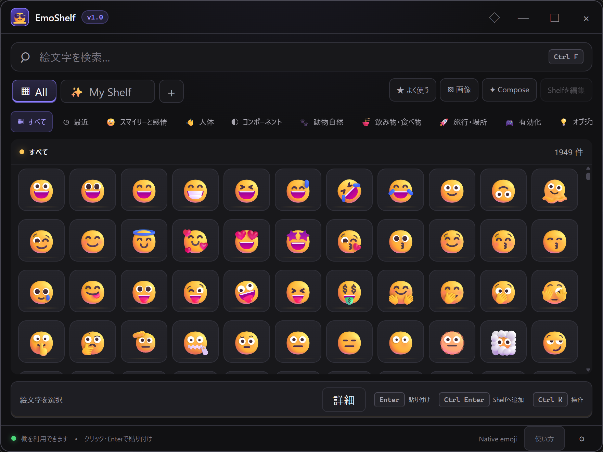

# EmoShelf

[English](./README.md) | **日本語**

<p align="center">
  
</p>

<p align="center"><strong>いつもの絵文字を、自分だけの棚に。</strong></p>

EmoShelfは、よく使う絵文字・絵文字の組み合わせ・記号・画像を、すぐに呼び出せるWindowsアプリです。データをローカルに保存し、軽快に使えることを目指しています。

<kbd>Alt</kbd> + <kbd>E</kbd>で呼び出し、自分の棚または**All（すべて）**から選んで貼り付け。アカウント、クラウド同期、利用状況の送信、オンラインのプロフィールは不要です。



2026年9月22日時点のローカル開発版の実画面です。今回の改善は公開済みRC 1のインストーラーには含まれません。正式公開に向けた検証は継続中です。

## 主な機能

- 自分だけの棚（Board）の作成、ドラッグでの並べ替え、削除と取り消し、アプリごとの棚の割り当て
- 左端に常設したAllタブと、1,949件の絵文字を日本語・英語の名前やタグから探せる検索
- 本体同梱のTwemojiとOS標準の絵文字表示。棚・一覧・詳細でOS標準の絵文字の配置を調整
- 絵文字の貼り付け、複数の絵文字を組み合わせる機能、組み合わせの保存、貼り付けできない場合のコピー対応
- PNG・WebP・安全性を確認したSVGの取り込みと、内容のハッシュを使ったローカル保存
- `.emoshelf`形式のバックアップ、内容のプレビュー、結合・置き換えによる復元
- グローバルショートカット、通常表示・固定表示、タスクトレイ常駐、自動起動、モニターに応じた配置、二重起動の防止
- ダーク・ライト・システム設定に合わせるテーマ、キーボード操作、フォーカス表示、ハイコントラスト、動きを減らす設定
- バックアップを取って手動更新。自動更新は信頼できる更新検証鍵の設定まで無効

## すぐに使う

呼び出し・貼り付けの信頼性を改善した未公開版を、配布拡大に向けて検証しています。
確認済みの挙動と未完了の互換性検証は、[公開前の検証記録](app/docs/release-qualification.md)を参照してください。
上の画像は現在の開発画面であり、外部アプリとの互換性を証明するものではありません。

```text
Alt + E → 棚 → 絵文字 → 入力先のアプリ
```

主なキーボード操作：

| キー | 操作 |
| --- | --- |
| `Ctrl+F` | 検索欄へ移動 |
| 矢印キー | 項目の選択を移動 |
| `Enter` | 貼り付け |
| `Ctrl+Enter` | 棚を開いたまま貼り付け、または検索結果を選択中の棚へ追加 |
| `Ctrl+K` | 自分の棚を表示しているときに棚の操作メニューを開く |
| `Ctrl+1..9` | 棚を切り替え |
| `Esc` | ダイアログ・検索を解除し、Allから自分の棚へ戻り、その後EmoShelfを隠す |

通常のクリックとEnterは、直前に使っていた入力欄へ貼り付けます。
クリックで貼り付けずに項目を確認したい場合は、**詳細**を開いてください。
**コピーのみ**の動作も設定できます。自動貼り付けできなかった場合は、表示される案内に従って入力先へ戻り、`Ctrl+V`で貼り付けてください。
**使い方**には、内容を保存しない練習用入力欄と、外部アプリで貼り付けを試す手順があります。

Alt+Eは、背面や最小化された状態からも棚を前面へ呼び出します。閉じるときはEscapeまたは閉じるボタンを使います。
**All**は全絵文字の一覧を開き、もう一度クリックすると検索とカテゴリの絞り込みを解除します。
既存の棚と`Ctrl+1..9`の割り当ては変わりません。実機でのキーボード操作と外部アプリとの互換性は引き続き検証中です。詳しくは上記の検証記録を参照してください。

## 絵文字の見た目：使えるものと今後の予定

| スタイル | 現在の利用状況 |
| --- | --- |
| Twemoji | 本体同梱。オフラインで利用可能 |
| Native / System（OS標準） | OSの絵文字フォントを使用。追加ダウンロード不要 |
| Fluent Emoji・Noto Emoji・OpenMoji | パックを扱う機能は実装済み。ダウンロード用パックは未公開 |

標準の2種類はすぐに使える状態で提供し、追加の3種類はGitHub Releasesで署名付きパックとして配布する方針です。
今後、アプリ内で見本を確認し、ダウンロード・導入・更新できる画面を追加します。導入後はオフラインで使えます。
**アプリ内ダウンロードはまだ実装されていません。** 現在は、信頼する検証鍵を組み込んだアプリで、手元のパックファイルを選んで導入できます。未導入・無効のパックは設定画面に明示します。

スタイル変更はEmoShelf内の表示に適用されます。他のアプリへ文字として貼り付けた絵文字は、そのアプリの絵文字フォントで表示されます。
残っている作業は[パックの仕様と配布手順](app/docs/renderer-packs.md)を参照してください。

## 開発状況 — 2026年9月26日

2026-09-26に日英のダウンロード・導入案内、共有メタ情報、スマートフォン表示、画面・カタログ読み込みの復旧、手動更新への導線、棚の読み上げラベルを改善しました。設定画面のEscが本体まで隠す不具合も修正しています。配布版にテスト用プラグインを入れずに実行する検査経路も整備しました。

最新の検査結果と配布候補のハッシュは[公開前レビュー](app/docs/launch-review-20260926.md)を参照してください。以前のRust 71件は過去の結果で、今回はRustの変更はありません。

未署名で配布する方針です。インストーラーの検証、ARM64での受け入れ、対象アプリ・表示倍率・アクセシビリティの全検証、性能確認、5営業日の安定利用が引き続き必要です。
[検証の証跡と未確認事項](app/docs/release-qualification.md)は、実装の完了状況と分けて記録しています。

## インストール

Windows 11のx64とARM64を対象に、**正式版もコード署名なしで配布**する方針です。インストーラーとチェックサムは[GitHub Releases](https://github.com/ELRdn/EmoShelf/releases)から入手してください。

現在入手できるのは、**未署名のテスト版**[v1.0.0 RC 1](https://github.com/ELRdn/EmoShelf/releases/tag/v1.0.0-rc.1)です。上記の開発版画面・改良より古い版です。Windowsで発行元不明やSmartScreenの警告が表示される場合があります。

正式版はソース・チェックサム・インストーラー・互換性の検証を経て公開します。SignPathによる署名提供は受けていません。[配布方針](./CODE_SIGNING_POLICY.md)も参照してください。ローカル候補やCIの生成物は公開済みリリースではありません。

### 未署名のリリース候補版をインストールする

**現在のRCも今後の正式版も未署名で提供します。** Windowsは証明書で発行元を確認できません。以下の入手元・チェックサムの確認を行ってください。業務用・学校管理のPCで未署名アプリが制限されている場合は、管理者に相談してください。

インストール前に、下記の公式配布ページからPCに合ったファイルを入手し、SHA-256の全桁を照合してください。ハッシュが一致しても、発行元の身元や安全性の証明にはなりません。
ファイルをスキャンし、Windowsの保護機能を有効に保ち、脅威の検出やポリシーによるブロックがあれば中止してください。
SmartScreenの**「詳細情報」→「実行」**を検討できるのは、認識されていないアプリについての警告だけで、入手元を信頼できる場合です。
このRCには本番用の更新設定がないため、バックアップを取って手動で更新してください。

#### 1. 公式配布ページから、自分のPC用のEXEを入手する

Windowsの **設定 → システム → バージョン情報 → システムの種類** で、プロセッサが「x64ベース」か「ARMベース」かを確認してください。「64ビット」という表示だけでは区別できません。

[公式v1.0.0-rc.1の配布ページ](https://github.com/ELRdn/EmoShelf/releases/tag/v1.0.0-rc.1)の**配布ファイル欄（Assets）**から、次のどちらか1つと`SHA256SUMS.txt`を同じフォルダーへダウンロードします。

| PCの種類 | ダウンロードするインストーラー |
| --- | --- |
| x64（Intel / AMD） | `EmoShelf_1.0.0-rc.1_windows-x86_64_UNSIGNED-setup.exe` |
| ARM64（Snapdragonなど） | `EmoShelf_1.0.0-rc.1_windows-aarch64_UNSIGNED-setup.exe` |

これはインストーラーであり、ポータブル版ではありません。通常はEXEだけでよく、MSIも重ねてインストールする必要はありません。`Source code (zip)` / `Source code (tar.gz)`はソースコードであり、そのまま実行するためのファイルではありません。

入手元が**`github.com/ELRdn/EmoShelf`**であることを確認してください。検索広告、非公式ミラー、DM・メール添付からは入手しないでください。ブラウザーが脅威を検出した場合はダウンロードを中止します。「一般的にダウンロードされていない」という評判の警告だけでも、安全と決めつけず、入手元とRCであることを確認してください。

#### 2. 実行する前にSHA-256を照合する

エクスプローラーでダウンロード先のフォルダーを開き、アドレスバーに`powershell`と入力してEnterを押します。管理者として開く必要はありません。選んだファイルに対応するコマンドを**どちらか1つ**実行してください。これはハッシュの表示だけを行い、EXEを起動しません。

x64の場合：

```powershell
Get-FileHash -LiteralPath '.\EmoShelf_1.0.0-rc.1_windows-x86_64_UNSIGNED-setup.exe' -Algorithm SHA256 | Format-List
```

ARM64の場合：

```powershell
Get-FileHash -LiteralPath '.\EmoShelf_1.0.0-rc.1_windows-aarch64_UNSIGNED-setup.exe' -Algorithm SHA256 | Format-List
```

同じ配布ページから取得した`SHA256SUMS.txt`をメモ帳で開き、**同じファイル名の行**と出力の`Hash`を比較します。64桁すべての一致が必要です（英字の大文字・小文字は無視できます）。先頭や末尾だけで判断しないでください。ファイル名に`(1)`などが付いている場合は、コマンドの名前を実際の名前に合わせ、照合先には元の配布ファイル名の行を使います。

不一致、ファイルが見つからない、該当するハッシュがない場合は、**インストールしないでください**。公式配布ページから取り直しても一致しなければ、[GitHubの課題報告ページ](https://github.com/ELRdn/EmoShelf/issues)へ報告してください。

ハッシュ一致は「公開されたチェックサムと同じ内容」という確認です。チェックサムも同じ配布元にあるため、配布元自体の侵害やアプリの無害性を保証せず、コード署名の代わりにはなりません。コマンドの仕様は[MicrosoftのGet-FileHash解説](https://learn.microsoft.com/en-us/powershell/module/microsoft.powershell.utility/get-filehash?view=powershell-5.1)を参照してください。

#### 3. スキャンし、警告の内容を確認してインストールする

1. Windowsとウイルス対策を最新にし、EXEを右クリック → **その他のオプションを確認 → Microsoft Defenderでスキャンする**を選びます。他社製ウイルス対策を利用中なら、その製品でスキャンしてください。検出がなくても安全の保証ではありません。[Microsoftのスキャン手順](https://support.microsoft.com/en-us/windows/scan-an-item-with-windows-security-d1c8c01d-12ed-e768-cbb8-830ea8ccf8e6)
2. 脅威が検出されず、入手元・ハッシュ・未署名RCであることを確認し、リスクを了承できた場合だけEXEをダブルクリックします。
3. SmartScreenの**「WindowsによってPCが保護されました」**が、認識されていないアプリについての警告だけである場合は、**「詳細情報」**でアプリ名を確認します。このRCでは発行元が**「不明な発行元」**になることがあります。これは認証済みという意味ではありません。確認したファイルを信頼し、自分の判断で進める場合に限り**「実行」**を選べます。不安なら**「実行しない」**で中止してください。[MicrosoftのSmartScreen案内](https://learn.microsoft.com/en-us/windows/apps/package-and-deploy/publish-first-app#step-6-handle-smartscreen-for-new-apps)
4. インストーラーの案内に従います。UAC（デバイスへの変更の許可）が表示された場合も、自分で起動したインストーラーか確認し、不明な別プログラムや想定外の要求ならキャンセルしてください。警告回避のために「管理者として実行」を使わないでください。

**次の場合は実行せず、必要に応じて管理者へ相談してください。**

- ウイルス・マルウェア・望ましくないアプリとして検出された、または隔離された。
- Smart App Control、組織のポリシー、Sモードなどで実行が禁止されている。
- 「実行」ボタンがない、または警告内容を判断できない。

Defenderのリアルタイム保護、SmartScreen、Smart App Controlを無効にしたり、除外設定を追加したり、隔離されたファイルを復元して強行したりしないでください。別形式のMSIに切り替えて制限を回避することも勧めません。Smart App Controlにはアプリ単位の例外許可がありません。[MicrosoftのSmart App Controlに関するよくある質問](https://support.microsoft.com/en-us/windows/security/threat-malware-protection/smart-app-control-frequently-asked-questions)

#### 4. 起動して、まずメモ帳で試す

1. スタートメニューから**EmoShelf**を起動し、初回案内で使いたい絵文字を選びます。言語や動作は設定で変更できます。
2. 通常権限で起動したメモ帳の入力欄をクリックし、**Alt+E**でEmoShelfを表示します。
3. 通常の棚表示（編集・組み合わせモードではない状態）で絵文字をクリックして貼り付けます。キーボードなら矢印キーで選んで**Enter**です。クリックした時点で貼り付けるため、続けてEnterを押す必要はありません。コピーのみの設定や貼り付けがうまくいかない場合は、EmoShelfでコピーしてからメモ帳へ戻り**Ctrl+V**で貼り付けてください。クリップボードの内容は置き換わります。
4. **Alt+E**が反応しない場合は、タスクトレイのアイコンから開き、設定で他アプリと競合しないショートカットに変更します。アイコンが隠れている場合はタスクバーの**∧**を開きます。

ウィンドウの閉じるボタンは終了ではなくトレイへの格納です。完全に終了するには、トレイアイコンを右クリック → **終了（Quit）**を選びます。貼り付け先が管理者権限で動いているなどの理由で貼り付けできない場合も、EmoShelfを昇格させず手動コピーを利用してください。

#### 5. バックアップ・更新・アンインストール

このRCには本番用の更新検証鍵が設定されていないため、アプリ内更新は利用できません。更新時は設定の**エクスポート（Export）**から**`.emoshelf`バックアップ**を保存し、アプリを終了して、公式配布ページの新しい版を確認してください。新しい配布物はその版のチェックサム・署名方針で確認し、RCのチェックサムを流用しないでください。

アンインストールはバックアップ後にトレイの**終了（Quit）**で終了し、Windowsの **設定 → アプリ → インストールされているアプリ → EmoShelf → アンインストール**から行います。保存データが必ず残るとは考えず、バックアップをアプリ外へ保管してください。

問題の報告先は[GitHubの課題報告ページ](https://github.com/ELRdn/EmoShelf/issues)です。RCタグ、ファイル名、Windowsのバージョンとx64/ARM64、警告文を添えてください。スクリーンショットの個人情報は隠し、クリップボードの内容や個人のバックアップファイルは公開しないでください。

## プライバシーとセキュリティ

EmoShelfはローカルでの利用を基本とし、利用状況の分析機能を含みません。任意で設定できるアプリ別の棚は、前面アプリの実行ファイル名とモニター識別子だけを使います。実行ファイルの完全なパスやウィンドウのタイトルを保存・送信することはありません。

- [プライバシー方針](./PRIVACY.md)
- [セキュリティ方針](./SECURITY.md)
- [コード署名の方針](./CODE_SIGNING_POLICY.md)
- [第三者のライセンス・帰属表示](./THIRD_PARTY_NOTICES.md)

## 開発

必要な環境：Node.js 22以降、pnpm 10以降、安定版Rust、WebView2、および[TauriのWindows向け前提条件](https://v2.tauri.app/start/prerequisites/)。

```powershell
cd app
pnpm install --frozen-lockfile
pnpm check
pnpm build
pnpm release:audit

cd src-tauri
cargo fmt --check
cargo clippy --locked -- -D warnings
cargo test --locked
cargo check --locked
```

`pnpm tauri dev`でデスクトップアプリを起動します。実ウィンドウを使うE2E検証にはWebDriverIOと`tauri-driver`を使用します。詳細は[アプリの開発ガイド](./app/README.md)を参照してください。

## 関連資料

- [設計仕様](./DESIGN.md)
- [ロードマップと受け入れ状況](./ROADMAP.md)
- [貢献ガイド](./CONTRIBUTING.md)
- [v1.0のリリースノート](./RELEASE_NOTES.md)
- [開発の引き継ぎ資料](./HANDOFF.md)

発行者：**ELRdn + Contributors**。サポートと製品への意見は[GitHubの課題報告ページ](https://github.com/ELRdn/EmoShelf/issues)で受け付けています。

## ライセンス

EmoShelfのアプリケーションコードは[Apache License 2.0](./LICENSE)で公開しています。絵文字の画像素材と第三者のコンポーネントには、それぞれのライセンスが適用されます。
