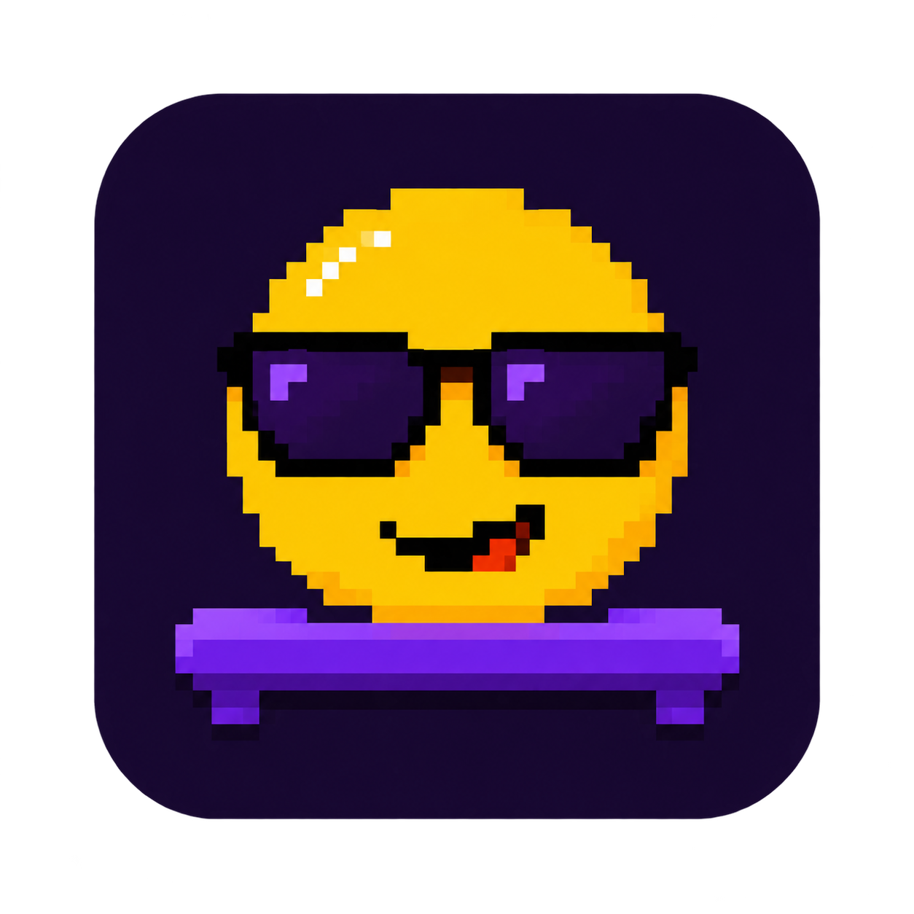
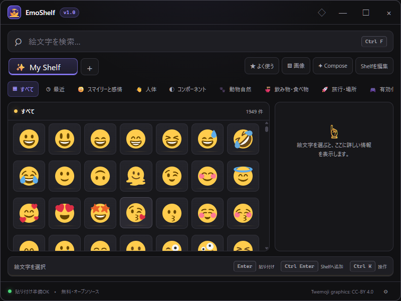

# EmoShelf

<p align="center">
  
</p>

<p align="center"><strong>Your personal emoji shelf.</strong></p>

EmoShelf is a fast, local-first Windows app for keeping the emojis, sequences, symbols, and custom images you actually use within instant reach.

Press <kbd>Alt</kbd> + <kbd>E</kbd>, choose from your Board, and paste. No account, cloud sync, telemetry, or remote profile is required.



## What it does

- Personal Boards with drag-and-drop ordering, safe delete/undo, and app-specific mapping
- Search across 1,949 emoji with English and Japanese names and tags
- Twemoji and native rendering, plus separately signed Fluent, Noto, and OpenMoji packs
- Single emoji paste, multi-emoji Compose Tray, reusable sequences, and copy-only fallback
- PNG, WebP, and sanitized SVG import with content-addressed local storage
- `.emoshelf` backup, preview, merge, and replace workflows
- Global shortcut, Quick/Pinned modes, system tray, autostart, monitor-aware placement, and single instance
- Dark, light, and system themes with keyboard navigation, visible focus, high-contrast support, and Reduced Motion
- User-approved, signature-verified updates

## Fast path

```text
Alt + E → Board → emoji → target application
```

Keyboard controls:

| Key | Action |
| --- | --- |
| `Ctrl+F` | Focus search |
| Arrow keys | Move through items |
| `Enter` | Paste |
| `Ctrl+Enter` | Keep open when pasting, or add a search result to the active Board |
| `Ctrl+K` | Open item actions |
| `Ctrl+1..9` | Switch Board |
| `Esc` | Close dialog, clear search, then hide EmoShelf |

## Install

Official builds target Windows 11 on x64 and ARM64. After the external signing gates are complete, signed installers and checksums are published on [GitHub Releases](https://github.com/ELRdn/EmoShelf/releases).

Formal `v1.0.0` artifacts are released only after SignPath Foundation approval, Authenticode verification, updater-signature verification, and installer smoke tests. Do not redistribute an unsigned CI artifact as an official release.

## Privacy and security

EmoShelf is local-first and does not include analytics. Optional app-aware Boards use only the foreground executable basename and monitor identifier; full paths and window titles are neither saved nor sent anywhere.

- [Privacy](./PRIVACY.md)
- [Security policy](./SECURITY.md)
- [Code-signing policy](./CODE_SIGNING_POLICY.md)
- [Third-party notices](./THIRD_PARTY_NOTICES.md)

## Development

Requirements: Node.js 22+, pnpm 10+, stable Rust, WebView2, and the [Tauri Windows prerequisites](https://v2.tauri.app/start/prerequisites/).

```powershell
cd app
pnpm install --frozen-lockfile
pnpm check
pnpm build
pnpm release:audit

cd src-tauri
cargo fmt --check
cargo clippy --locked -- -D warnings
cargo test --locked
cargo check --locked
```

Run the desktop app with `pnpm tauri dev`. Real-window E2E uses WebDriverIO and `tauri-driver`; see [app/README.md](./app/README.md).

## Project guide

- [Design specification](./DESIGN.md)
- [Roadmap and acceptance status](./ROADMAP.md)
- [Contributor guide](./CONTRIBUTING.md)
- [v1.0 release notes](./RELEASE_NOTES.md)
- [Engineering handoff](./HANDOFF.md)

Publisher: **ELRdn + Contributors**. Support and product feedback are handled through [GitHub Issues](https://github.com/ELRdn/EmoShelf/issues).

## License

EmoShelf application code is licensed under [Apache License 2.0](./LICENSE). Emoji artwork and third-party components remain under their respective licenses.
