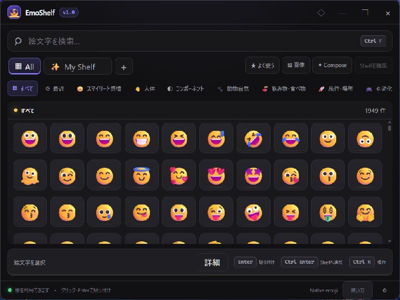

# EmoShelf

**English** | [日本語](./README.jp.md)

<p align="center">
  
</p>

<p align="center"><strong>Your personal emoji shelf.</strong></p>

EmoShelf is a fast, local-first Windows app for keeping the emojis, sequences, symbols, and custom images you actually use within instant reach.

Press <kbd>Alt</kbd> + <kbd>E</kbd>, choose from your Board or **All**, and paste. No account, cloud sync, telemetry, or remote profile is required.



Actual local development build, September 22, 2026. These changes are not included
in the published RC 1 installer; formal release qualification is still in progress.

## What it does

- Personal Boards with drag-and-drop ordering, safe delete/undo, and app-specific mapping
- A permanent leftmost **All** tab and search across 1,949 emoji with English and Japanese names and tags
- Bundled Twemoji and OS-native emoji, with corrected native alignment across the shelf, catalog and details
- Single emoji paste, multi-emoji Compose Tray, reusable sequences, and copy-only fallback
- PNG, WebP, and sanitized SVG import with content-addressed local storage
- `.emoshelf` backup, preview, merge, and replace workflows
- Global shortcut, Quick/Pinned modes, system tray, autostart, monitor-aware placement, and single instance
- Dark, light, and system themes with keyboard navigation, visible focus, high-contrast support, and Reduced Motion
- Update support with explicit consent and signature verification; production signing setup is still pending

## Fast path

The unreleased reliability refresh is being qualified before broader distribution.
See the [release qualification record](app/docs/release-qualification.md) for verified
behavior and pending compatibility/signing checks. The screenshot shows the current
development UI; it does not demonstrate external application compatibility.

```text
Alt + E → Board → emoji → target application
```

Keyboard controls:

| Key | Action |
| --- | --- |
| `Ctrl+F` | Focus search |
| Arrow keys | Move through items |
| `Enter` | Paste |
| `Ctrl+Enter` | Keep open when pasting, or add a search result to the active Board |
| `Ctrl+K` | Open Board actions in the personal Shelf view |
| `Ctrl+1..9` | Switch Board |
| `Esc` | Dismiss dialog/search, return from All to Shelf, then hide EmoShelf |

Normal clicks and Enter paste into the previously active editor. Open **Details**
to inspect items without pasting on click. **Copy only** is an explicit setting.
If automatic insertion is unavailable, return to your editor and press `Ctrl+V`;
the shelf keeps a visible recovery message. **How to use** includes a private,
unsaved practice editor and the steps for trying insertion in another app.

Alt+E always brings the shelf forward, including from the background or a minimized
window. Use Escape or the close button to dismiss it. **All** opens the entire
catalog; clicking it again clears the search and category filter. Personal Boards
and their `Ctrl+1..9` assignments are unchanged. Physical keyboard coverage and
external-app compatibility are still being qualified; see the linked record.

## Emoji styles: available now and next

| Style | Current availability |
| --- | --- |
| Twemoji | Included with the app; usable offline |
| Native / System | Uses the OS emoji font; no additional download |
| Fluent Emoji, Noto Emoji, OpenMoji | Pack support implemented; downloadable packs are not yet published |

The agreed distribution model keeps the defaults immediately usable and distributes
the three optional styles as signed assets on GitHub Releases. A future in-app
style gallery will show previews and offer download/install/update controls; an
installed pack will remain usable offline. **That download flow is not implemented
yet.** The current UI can import a local pack file when the app was built with its
trusted verification key, and identifies missing or disabled packs explicitly.

Style changes affect EmoShelf's preview. Unicode pasted into another application
uses that application's emoji font. See the [pack specification and delivery
checklist](app/docs/renderer-packs.md) for the remaining work.

## Development checkpoint — September 22, 2026

Local checks passed: **84 frontend tests, 7 tooling tests, 71 Rust tests, and 10
desktop E2E scenarios**. The Rust results cover the native Alt+E/paste changes;
later All/style changes are frontend changes. Native alignment was also checked
at four sizes. External insertion has only limited Notepad smoke coverage on the
earlier Alt+E candidate, not the full acceptance matrix on the latest binary.

The latest local x64 candidate is unsigned. Signed installers, ARM64 acceptance,
the full app/DPI/accessibility matrix, performance qualification and five business
days of stable use remain required. [Evidence and limitations](app/docs/release-qualification.md)
are recorded separately from implementation completion.

## Install

Official builds target Windows 11 on x64 and ARM64. Signed installers and checksums are published on [GitHub Releases](https://github.com/ELRdn/EmoShelf/releases) after the external signing gates are complete.

To establish the public release history required for a SignPath Foundation application, EmoShelf may publish a clearly labelled **unsigned prerelease**. The current [v1.0.0 RC 1](https://github.com/ELRdn/EmoShelf/releases/tag/v1.0.0-rc.1) is such an application build: it is not the formal release, and Windows may show an unknown-publisher or SmartScreen warning.

Formal `v1.0.0` artifacts are released only after SignPath Foundation approval, Authenticode verification, updater-signature verification, and installer smoke tests. Do not redistribute an unsigned prerelease or CI artifact as an official release.

### Installing the unsigned release candidate

**The current RC is an unsigned test build, not an official signed release. SignPath approval and signing configuration will be rechecked before preparing the next distribution candidate.** Without a signature, Windows cannot verify the publisher through a certificate. The checks below reduce risk but do not guarantee safety. If you are unsure, or use a work- or school-managed PC, wait for the signed release or consult your administrator.

Before installing, use only the linked GitHub Release, choose the matching architecture, and compare the complete SHA-256. A matching hash is not proof of publisher identity or safety. Scan the file, keep Windows protections enabled, and stop on a threat detection or policy block. Only consider the per-file SmartScreen **More info → Run anyway** option if the warning is solely about an unrecognized app and you trust the source. This RC has no production updater configured; back up and update manually.

#### 1. Download the EXE for your PC from the official release

In Windows, open **Settings → System → About → System type** and check whether your processor is x64-based or ARM-based. The label "64-bit" alone does not distinguish them.

Under **Assets** on the [official v1.0.0-rc.1 release](https://github.com/ELRdn/EmoShelf/releases/tag/v1.0.0-rc.1), download one of the following installers and `SHA256SUMS.txt` into the same folder.

| PC type | Installer to download |
| --- | --- |
| x64 (Intel / AMD) | `EmoShelf_1.0.0-rc.1_windows-x86_64_UNSIGNED-setup.exe` |
| ARM64 (such as Snapdragon) | `EmoShelf_1.0.0-rc.1_windows-aarch64_UNSIGNED-setup.exe` |

These are installers, not portable builds. The EXE is normally sufficient; you do not also need to install the MSI. `Source code (zip)` and `Source code (tar.gz)` are not ready-to-run applications.

Confirm that the source is **`github.com/ELRdn/EmoShelf`**. Do not download through search ads, unofficial mirrors, direct messages, or email attachments. Stop if your browser detects a threat. Even if the warning only says the file is not commonly downloaded, do not assume it is safe: verify the source and remember that this is a release candidate.

#### 2. Compare the SHA-256 before running the installer

Open the download folder in File Explorer, type `powershell` in the address bar, and press Enter. Administrator privileges are not required. Run **only the command matching your downloaded file**. It displays the hash without launching the EXE.

x64:

```powershell
Get-FileHash -LiteralPath '.\EmoShelf_1.0.0-rc.1_windows-x86_64_UNSIGNED-setup.exe' -Algorithm SHA256 | Format-List
```

ARM64:

```powershell
Get-FileHash -LiteralPath '.\EmoShelf_1.0.0-rc.1_windows-aarch64_UNSIGNED-setup.exe' -Algorithm SHA256 | Format-List
```

Open `SHA256SUMS.txt` from the same release in Notepad. Compare the output's `Hash` with **the line for the same filename**. All 64 characters must match; letter case does not matter. Do not check only the beginning or end. If the downloaded filename has a suffix such as `(1)`, adjust the command to match the actual filename, but compare against the checksum entry for the original release filename.

**Do not install** if the hashes differ, the file cannot be found, or there is no matching checksum entry. Download it again from the official release. If it still does not match, report the issue through [GitHub Issues](https://github.com/ELRdn/EmoShelf/issues).

A matching hash confirms that the bytes match the published checksum. Because the checksum comes from the same source, it does not protect against compromise of that source or prove that the app is harmless. It is not a substitute for code signing. See [Microsoft's Get-FileHash documentation](https://learn.microsoft.com/en-us/powershell/module/microsoft.powershell.utility/get-filehash?view=powershell-5.1) for the command reference.

#### 3. Scan the file, review warnings, and install

1. Update Windows and your antivirus software. Right-click the EXE and select **Show more options → Scan with Microsoft Defender**. If you use another antivirus product, scan with that instead. A clean scan does not guarantee safety. [Microsoft's scanning instructions](https://support.microsoft.com/en-us/windows/scan-an-item-with-windows-security-d1c8c01d-12ed-e768-cbb8-830ea8ccf8e6)
2. Double-click the EXE only if no threat was detected, you verified the source and hash, and you accept the risks of using an unsigned RC.
3. If SmartScreen's **"Windows protected your PC"** message is solely a warning about an unrecognized app, select **More info** to check the app name. This RC may show **Unknown publisher**, which does not mean the publisher is verified. Choose **Run anyway** only if you trust the verified file and decide to proceed. If unsure, select **Don't run**. [Microsoft's SmartScreen guidance](https://learn.microsoft.com/en-us/windows/apps/package-and-deploy/publish-first-app#step-6-handle-smartscreen-for-new-apps)
4. Follow the installer. If User Account Control asks to allow changes to your device, confirm that it is the installer you launched. Cancel if it names an unfamiliar program or makes an unexpected request. Do not use **Run as administrator** to bypass warnings.

**Do not run the installer in the following cases. Wait for a signed build or consult your administrator.**

- The file is detected as a virus, malware, or an unwanted app, or is quarantined.
- Smart App Control, an organization policy, or S mode blocks execution.
- There is no **Run anyway** button, or you cannot determine what the warning means.

Do not disable Defender real-time protection, SmartScreen, or Smart App Control; add antivirus exclusions; or restore a quarantined file to force installation. Do not switch to the MSI to bypass a restriction. Smart App Control does not support exceptions for individual apps. [Microsoft's Smart App Control FAQ](https://support.microsoft.com/en-us/windows/security/threat-malware-protection/smart-app-control-frequently-asked-questions)

#### 4. Launch EmoShelf and try it in Notepad

1. Launch **EmoShelf** from the Start menu and choose your preferred emoji during onboarding. You can change the language and behavior in settings.
2. Click the editing area in a normally launched, non-administrator Notepad window, then press **Alt+E** to open EmoShelf.
3. In the normal Board view, outside edit or Compose mode, click an emoji to paste it. For keyboard use, select it with the arrow keys and press **Enter**. A click already pastes, so do not press Enter afterward. In copy-only mode, or if automatic pasting fails, copy in EmoShelf, return to Notepad, and press **Ctrl+V**. This replaces your clipboard contents.
4. If **Alt+E** does not respond, open EmoShelf from its system tray icon and choose a shortcut that does not conflict with another app. If the icon is hidden, open the taskbar's **∧** menu.

The window's close button hides EmoShelf in the tray; it does not quit the app. To exit completely, right-click the tray icon and select **Quit**. If pasting fails because the target app runs as administrator or for another reason, use manual copying rather than elevating EmoShelf.

#### 5. Back up, update, and uninstall

This RC does not have a production updater public key, so in-app updates are unavailable. Before updating, save a **`.emoshelf` backup** using Export in settings, quit the app, and check the official Releases page for a newer version. Verify the new files using that release's checksums and signing policy; do not reuse the RC's checksums.

To uninstall, back up your data, select **Quit** in the tray menu, then open **Settings → Apps → Installed apps → EmoShelf → Uninstall** in Windows. Do not assume that saved data will survive uninstallation; keep your backup outside the app's storage.

Report problems through [GitHub Issues](https://github.com/ELRdn/EmoShelf/issues). Include the RC tag, filename, Windows version, x64/ARM64 architecture, and warning text. Hide personal information in screenshots, and do not publish clipboard contents or personal backup files.

## Privacy and security

EmoShelf is local-first and does not include analytics. Optional app-aware Boards use only the foreground executable basename and monitor identifier; full paths and window titles are neither saved nor sent anywhere.

- [Privacy](./PRIVACY.md)
- [Security policy](./SECURITY.md)
- [Code-signing policy](./CODE_SIGNING_POLICY.md)
- [Third-party notices](./THIRD_PARTY_NOTICES.md)

## Development

Requirements: Node.js 22+, pnpm 10+, stable Rust, WebView2, and the [Tauri Windows prerequisites](https://v2.tauri.app/start/prerequisites/).

```powershell
cd app
pnpm install --frozen-lockfile
pnpm check
pnpm build
pnpm release:audit

cd src-tauri
cargo fmt --check
cargo clippy --locked -- -D warnings
cargo test --locked
cargo check --locked
```

Run the desktop app with `pnpm tauri dev`. Real-window E2E uses WebDriverIO and `tauri-driver`; see [app/README.md](./app/README.md).

## Project guide

- [Design specification](./DESIGN.md)
- [Roadmap and acceptance status](./ROADMAP.md)
- [Contributor guide](./CONTRIBUTING.md)
- [v1.0 release notes](./RELEASE_NOTES.md)
- [Engineering handoff](./HANDOFF.md)

Publisher: **ELRdn + Contributors**. Support and product feedback are handled through [GitHub Issues](https://github.com/ELRdn/EmoShelf/issues).

## License

EmoShelf application code is licensed under [Apache License 2.0](./LICENSE). Emoji artwork and third-party components remain under their respective licenses.
